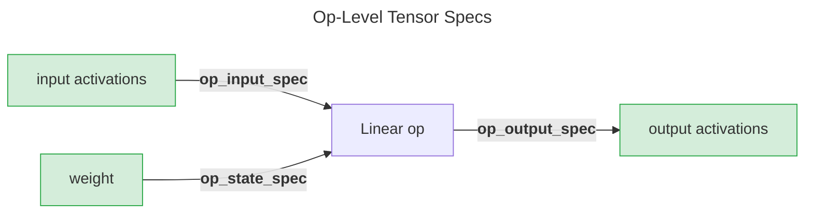
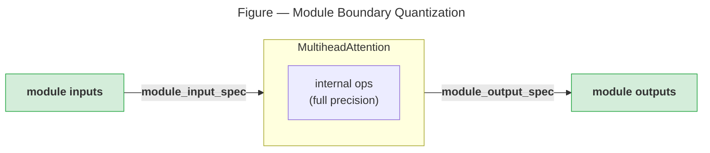
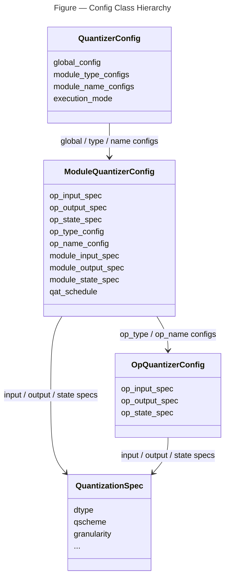

# Config API

{class}`~coreai_opt.quantization.config.QuantizerConfig` controls which ops/modules get quantized and how — the dtype,
granularity etc. It is defined using two types of dataclass-like classes (specifically, `pydantic.BaseModel` is used internally):

1. **Spec class** ({class}`~coreai_opt.quantization.spec.QuantizationSpec`): describes how a single tensor is quantized. All higher-level configs assign specs to specific tensors in specific ops/modules. Meant to be described first and then reused in different scopes (globally across the model, within certain modules, for certain ops etc).
2. **Config classes** ({class}`~coreai_opt.quantization.config.QuantizerConfig`, {class}`~coreai_opt.quantization.config.ModuleQuantizerConfig`, {class}`~coreai_opt.quantization.config.OpQuantizerConfig`): Define a hierarchical structure that specifies which quantization specs to apply to which ops and modules in the model.

Regarding the terminology of ops and modules, as used in these APIs, here is what each refers to:

- modules: these refer to the `torch.nn.Module` objects that are used in the PyTorch model definition code. This includes user-defined modules (e.g. resnet.bottleneck) and in-built modules (e.g. nn.Linear), as returned by calling `.named_modules()` on the `model`.
- ops:
  - For graph execution mode (default): these refer to nodes in the exported PyTorch graph. That is, the target values of all the `call_function` nodes, which correspond to `aten` ops.
  - For eager execution mode: these refer to all the `TorchFunction` call sites. These typically correspond to aten ops as well.

{class}`~coreai_opt.quantization.config.QuantizerConfig` lets you customize quantization settings for different parts of the model, via either modules or ops, or a combination of both.

We will first take a look at the {class}`~coreai_opt.quantization.spec.QuantizationSpec` class and then through examples, will walk over how to define the config classes (and thereby covering how they are structured).

## QuantizationSpec

{class}`~coreai_opt.quantization.spec.QuantizationSpec` defines the following key properties, among others (for full list see API reference):

- `dtype`: dtype of quantized data, e.g. `int8`, `int4`, `uint2`, `float8_e4m3fn`, `float4_e2m1fn_x2` etc (default: torch.int8)
- `qscheme`: symmetric or asymmetric quantization scheme (default: {class}`~coreai_opt.quantization.spec.QuantizationScheme`.SYMMETRIC). See [Symmetric vs asymmetric quantization](advanced.md#symmetric-vs-asymmetric-quantization) for how these schemes differ.
- `granularity`: granularity for quantization scales/zp, per-block, per-channel, per-tensor (default: {class}`~coreai_opt.quantization.spec.PerTensorGranularity()`)
- `qparam_calculator_cls`: algorithm used for calculating scales/zp, e.g. static, global min/max, moving average min/max etc. (defaults: {class}`~coreai_opt.quantization.spec.MovingAverageQParamsCalculator` for activations)
- `scale_dtype`: dtype for the quantization scale to be used. (Default: None, picked automatically based on quantization `dtype`)
  Example:

```python
from coreai_opt.quantization import QuantizationSpec
from coreai_opt.quantization.spec import (
    PerBlockGranularity,
    QuantizationScheme,
    default_activation_quantization_spec,
    default_weight_quantization_spec,
)

# int8 symmetric per-channel, static qparams (for weights)
weight_spec = default_weight_quantization_spec()

# int8 symmetric per-tensor, moving-average qparams (for activations)
activation_spec = default_activation_quantization_spec()

# Custom spec — int4 per-block for low-bit weights
int4_spec = QuantizationSpec(
    dtype=torch.int4,
    qscheme=QuantizationScheme.SYMMETRIC,
    granularity=PerBlockGranularity(block_size=32),
)
```

### A Note on Granularity

Three granularity types are available: `PerTensorGranularity`, `PerChannelGranularity`, and `PerBlockGranularity`. They control how finely weights are quantized, from coarsest to finest, trading more metadata for higher recovered accuracy. Depending on the granularity type, parameters such as `axis` (which dimension to quantize along) and `block_size` (how many elements per block) can be used to tailor the behavior for different layers or weight tensors. For `PerChannelGranularity` and `PerBlockGranularity`, the `axis` parameter can be omitted -- see below.

#### Default weight axis values for per-channel and per-block granularity

When using `PerChannelGranularity()` or `PerBlockGranularity(block_size=B)` for weight quantization, the `axis` parameter can be omitted (or set to `None`). `coreai-opt` resolves the correct default based on the module type during model preparation.

**How are the defaults chosen?**

Per-channel quantization assigns an independent scale and zero-point to each output channel. In a convolution layer for instance, each output channel corresponds to a separate learned filter with its own weight distribution, so quantizing per output channel preserves accuracy better than a single per-tensor scale. The default axis therefore points to the output channel dimension of the weight tensor.

Per-block quantization provides finer granularity than per-tensor by dividing the weight tensor into blocks of size `B` along one axis. The default axis is the non-output-channel dimension (typically input channels). Along this axis, weights are grouped into consecutive blocks of `B` elements, each receiving its own scale. The output-channel axis is left unblocked (equivalent to `block_size=1`), so each output channel is still treated independently.

For transposed convolution layers, the output and input channel dimensions are swapped in the weight tensor, so the default axes are also swapped.

The axis defaults for each layer/module type, along with their respective weight and scale shapes, are as follows:

**Per-channel axis defaults** (`PerChannelGranularity()`):

| Module type                                               | Weight shape                   | Default axis | Scale shape             |
| --------------------------------------------------------- | ------------------------------ | ------------ | ----------------------- |
| `Conv1d` / `Conv2d` / `Conv3d`                            | `(C_out, C_in, K_1, ..., K_n)` | 0            | `(C_out, 1, 1, ..., 1)` |
| `ConvTranspose1d` / `ConvTranspose2d` / `ConvTranspose3d` | `(C_in, C_out, K_1, ..., K_n)` | 1            | `(1, C_out, 1, ..., 1)` |
| `Linear`                                                  | `(C_out, C_in)`                | 0            | `(C_out, 1)`            |
| `Embedding`                                               | `(V, D)`                       | 0            | `(V, 1)`                |

**Per-block axis defaults** (`PerBlockGranularity(block_size=B)`):

| Module type                                               | Weight shape                   | Default axis | Scale shape                  |
| --------------------------------------------------------- | ------------------------------ | ------------ | ---------------------------- |
| `Conv1d` / `Conv2d` / `Conv3d`                            | `(C_out, C_in, K_1, ..., K_n)` | 1            | `(C_out, C_in/B, 1, ..., 1)` |
| `ConvTranspose1d` / `ConvTranspose2d` / `ConvTranspose3d` | `(C_in, C_out, K_1, ..., K_n)` | 0            | `(C_in/B, C_out, 1, ..., 1)` |
| `Linear`                                                  | `(C_out, C_in)`                | 1            | `(C_out, C_in/B)`            |
| `Embedding`                                               | `(V, D)`                       | 1            | `(V, D/B)`                   |

**Notes:**

- Kernel dimensions (`K_1, ..., K_n`) collapse to 1 in the scale shape because the entire kernel extent is included in each block/channel.
- If no axis is provided for an op/layer type not listed above (e.g., a custom module), `Quantizer.prepare()` raises a `ValueError`.

See [Example: Overriding default axis for a specific layer](#example-overriding-default-axis-for-a-specific-layer) for how to use these defaults in a quantizer config and override them for specific layers.

## QuantizerConfig creation: yaml or programmatic

Config can be created from YAML, a dict, or programmatically. The same concepts apply whether you
write them in YAML or Python. Both methods produce identical config objects and can be
used interchangeably.

YAML is better for static configurations checked into version control. Python is better
when the layers to configure depend on runtime conditions — for example, selecting specs
based on layer size or architecture. The examples throughout this section show both
approaches side by side.

```python
# From YAML file
config = QuantizerConfig.from_yaml("config.yaml")

# From dict
config = QuantizerConfig.from_dict({"quantization_config": {...}})

# Programmatic
config = QuantizerConfig(global_config=ModuleQuantizerConfig(...))
```

`from_yaml()` and `from_dict()` parse the configuration under the top-level key:

- `quantization_config` for {class}`~coreai_opt.quantization.config.QuantizerConfig`
- `kmeans_palettization_config` for {class}`~coreai_opt.palettization.config.KMeansPalettizerConfig`.

## Config classes and their defaults

The quantization config system uses three nested classes, each controlling a different scope:

- {class}`~coreai_opt.quantization.config.QuantizerConfig` — the top-level config for the entire model. It holds a `global_config` (applied to all modules by default), plus optional `module_type_configs` and `module_name_configs` for overrides. Precedence: `module_name_configs` > `module_type_configs` > `global_config`.

- {class}`~coreai_opt.quantization.config.ModuleQuantizerConfig` — controls quantization for all ops within a module's scope for a particular module type or name (or all modules if used as a `global_config`). It specifies default specs for op inputs, outputs, and state, and allows per-op overrides via `op_type_config` and `op_name_config`.

- {class}`~coreai_opt.quantization.config.OpQuantizerConfig` — controls quantization for a specific op type or op name. It has the same three tensor-group fields (`op_input_spec`, `op_output_spec`, `op_state_spec`) scoped to that specific op type or name.

### Default behavior when no arguments are provided

Creating any of these config classes with no arguments gives you a ready-to-use **W_INT8_A_INT8** configuration:

```python
# All three of these produce equivalent default quantization settings:
config = QuantizerConfig()
# is equivalent to:
config = QuantizerConfig(global_config=ModuleQuantizerConfig())
# which is equivalent to:
config = QuantizerConfig(
    global_config=ModuleQuantizerConfig(
        op_input_spec={"*": default_activation_quantization_spec()},
        op_output_spec={"*": default_activation_quantization_spec()},
        op_state_spec={"weight": default_weight_quantization_spec()},
    )
)

op_config = OpQuantizerConfig()
# is equivalent to:
op_config = OpQuantizerConfig(
    op_input_spec={"*": default_activation_quantization_spec()},
    op_output_spec={"*": default_activation_quantization_spec()},
    op_state_spec={"weight": default_weight_quantization_spec()},
)
```

The defaults are:

```{list-table}
:header-rows: 1

* - Tensor group
  - Default spec
  - What it does
* - `op_input_spec`
  - `{"*": default_activation_quantization_spec()}`
  - Quantize all op inputs: INT8, symmetric, per-tensor, moving-average qparam calculator.
* - `op_output_spec`
  - `{"*": default_activation_quantization_spec()}`
  - Quantize all op outputs: same as inputs.
* - `op_state_spec`
  - `{"weight": default_weight_quantization_spec()}`
  - Quantize parameters named `"weight"`: INT8, symmetric, per-channel (output channel axis),
    static qparam calculator.

    Other state tensors (e.g., `"bias"`) are left at full precision.
```

## Examples

In [Quantization Overview](overview.md) we saw how to use the default `W_INT8_A_INT8` config. [Config classes and their defaults](#config-classes-and-their-defaults) described the default settings in `QuantizerConfig()`, `ModuleQuantizerConfig()`, and `OpQuantizerConfig()`. Let us now see how to configure quantization when non-default settings are desired.

Several examples below configure specific module names, module types, op names, or op types. To determine these for your model, see [Inspecting Model Structure](../utils/model_inspection.md).

### Example: `W_MXFP4_A_FP8` applied to all supported ops

```python
# programmatic

from coreai_opt.quantization.config import QuantizerConfig, ModuleQuantizerConfig
from coreai_opt.quantization import QuantizationSpec
from coreai_opt.quantization.spec import PerBlockGranularity

# Define quantization specs
# FP8 symmetric, per tensor scales
fp8_activation = QuantizationSpec(
    dtype=torch.float8_e4m3fn,
)
# FP4 symmetric, per block scales with E8M0 scale dtype
mxfp4_weight = QuantizationSpec(
    dtype=torch.float4_e2m1fn_x2,
    granularity=PerBlockGranularity(block_size=32),
    scale_dtype=torch.float8_e8m0fnu,
)

# Create configuration
config = QuantizerConfig(
    global_config=ModuleQuantizerConfig(
        op_input_spec={"*": fp8_activation},
        op_output_spec={"*": fp8_activation},
        op_state_spec={"weight": mxfp4_weight},
    )
)
```

```yaml
# yaml config
quantization_spec:
  spec1: &fp8_activation
    dtype: float8_e4m3fn

  spec2: &mxfp4_weight
    dtype: float4_e2m1fn_x2
    granularity: { type: per_block, block_size: 32 }
    scale_dtype: float8_e8m0fnu

quantization_config:
  global_config:
    op_input_spec:
      "*": *fp8_activation # Quantize all op inputs
    op_output_spec:
      "*": *fp8_activation # Quantize all op outputs
    op_state_spec:
      weight: *mxfp4_weight # Quantize weight tensors
```

This config would apply the FP4 quantization to all supported ops' weights, and FP8 quantization to all supported ops' activations at both inputs and outputs. (See discussion in [Two Execution Modes](overview.md#two-execution-modes-graph-and-eager) on the supported ops and patterns for quantization).

`global_config` allows access to the scope of all supported ops and modules in the model.

Three fields target specific tensor groups within a module's operation:

- `op_input_spec` — controls quantization setting for inputs to all ops in the scope (global in this case). `{"*": spec}` quantizes all supported inputs;
  `None` disables.
- `op_output_spec` — output activations from ops.
- `op_state_spec` — weights and other tensors present in the `state_dict`. Use `{"weight": spec}` to target just the weights (i.e. this would exclude `bias` etc).

Setting any field to `None` disables compression for that tensor group. For example,
weight-only quantization sets `op_input_spec=None` and `op_output_spec=None` (as seen in [Weight-Only Quantization](overview.md#weight-only-quantization-data-free-ptq)).



### Example: Skip quantization for a specific layer type

Let's say we want to skip all `linear` layers in the model from being quantized. Since linear is commonly used as `nn.Module` in model definition, there are two equivalent ways to do this:

**1. Skip `linear` by targeting it as an "op":**

```python
# programmatic
config = QuantizerConfig(
    global_config=ModuleQuantizerConfig(
        op_type_config={"linear": None},
    )
)
```

```yaml
# yaml
quantization_config:
  global_config:
    op_type_config:
      linear: null
```

Unspecified `op_input_spec`, `op_output_spec`, `op_state_spec` in {class}`~coreai_opt.quantization.config.ModuleQuantizerConfig` lead to their defaults, hence the global config is W_INT8_per_channel_A_INT8_per_tensor.
`op_type_config` lets you override that for the specified op types. Set an op to `None` to leave it at full
precision.

**2. Skip `linear` by targeting it as a "module":**

```python
# programmatic
config = QuantizerConfig(
    module_type_configs={"torch.nn.modules.linear.Linear": None},
)
```

```yaml
# yaml
quantization_config:
  module_type_configs:
    torch.nn.modules.linear.Linear: null
```

Unspecified `global_config` leads to the default quant setting. `module_type_configs` overrides that for the specified module types. Keys must be the
fully-qualified Python class name (e.g., `"torch.nn.modules.linear.Linear"`). Short-form
names like `"torch.nn.Linear"` are not supported — the key must match the internal module
path exactly.

For linear, both options exist, whereas if the layer to be skipped is not a PyTorch module, e.g. torch.add, torch.concat etc, then targeting it as an op is the way to go.

What if we want to skip quantization for a layer type **not globally, but only if it is inside a certain module?**

**3. Skip quantizing I/O of `Softmax` op within a certain module type**:

```python
# programmatic
config = QuantizerConfig(
    module_type_configs={
        "mymodelSelfAttention": ModuleQuantizerConfig(
            op_type_config={"softmax": None},
        )
    },
)
```

```yaml
# yaml
quantization_config:
  module_type_configs:
    mymodelSelfAttention:
      op_type_config:
        softmax: null
```

My model's definition defines a module called `mymodelSelfAttention` and uses it repeatedly.
The above config will quantize the full model (W_INT8_A_INT8) except the softmax layers which are inside any module of type
`mymodelSelfAttention`.

**4. Skip quantizing I/O of `Softmax` op within a specific module, identified by its name**:

```python
# programmatic
config = QuantizerConfig(
    module_name_configs={
        "model.selfattention.layer.0": ModuleQuantizerConfig(
            op_type_config={"softmax": None},
        )
    },
)
```

```yaml
# yaml
quantization_config:
  module_name_configs:
    model.selfattention.layer.0:
      op_type_config:
        softmax: null
```

Instead of `module_type_configs`, use `module_name_configs` to further limit the scope to a specific module, instead of all instances of a specific module type.

**5. Skip quantizing only the output of `concat`, globally**:

```python
# programmatic
from coreai_opt.quantization import (
    ModuleQuantizerConfig,
    QuantizerConfig,
)
from coreai_opt.quantization.config import OpQuantizerConfig
from coreai_opt.quantization.spec import default_activation_quantization_spec

activation_spec = default_activation_quantization_spec()
config = QuantizerConfig(
    global_config=ModuleQuantizerConfig(
        op_type_config={
            "concat": OpQuantizerConfig(
                op_input_spec={
                    "*": activation_spec
                },  # all input tensors will get quantized
                op_output_spec=None,  # output tensor is not quantized
            )
        },
    )
)
```

```yaml
# yaml
quantization_spec:
  activation_spec: &activation_spec
    dtype: int8
    qscheme: symmetric
    granularity: { type: per_tensor }

quantization_config:
  global_config:
    op_type_config:
      concat:
        op_input_spec:
          "*": *activation_spec
        op_output_spec: null
```

`op_type_config` maps op type names to {class}`~coreai_opt.quantization.config.OpQuantizerConfig` instances, allowing different quantization per operation type. Set an op to `None` to leave it at full precision.
{class}`~coreai_opt.quantization.config.OpQuantizerConfig` has the same three fields as {class}`~coreai_opt.quantization.config.ModuleQuantizerConfig` (`op_input_spec`, `op_output_spec`, `op_state_spec`), but scoped to that operation type only.

### Example: Enable quantization only for specific layers

Instead of picking the default of applying quantization to all and then disabling some, let's look at the opposite.

**1. Quantize only `linear` layers**:

```python
# programmatic

# Define quantization specs
int8_activation = QuantizationSpec(dtype="int8", granularity={"type": "per_tensor"})
int8_weight = QuantizationSpec(dtype="int8", granularity={"type": "per_channel"})

# Create configuration
config = QuantizerConfig(
    global_config=None,  # Disable global quantization
    module_type_configs={
        "torch.nn.modules.linear.Linear": ModuleQuantizerConfig(
            op_input_spec={"*": int8_activation},
            op_output_spec={"*": int8_activation},
            op_state_spec={"weight": int8_weight},
        )
    },
)
```

```yaml
# yaml
quantization_spec:
  spec1: &int8_activation
    dtype: int8
    granularity:
      type: per_tensor

  spec2: &int8_weight
    dtype: int8
    granularity:
      type: per_channel

quantization_config:
  global_config: null # Disable global quantization

  # Enable quantization only for all Linear layers
  module_type_configs:
    torch.nn.modules.linear.Linear:
      op_input_spec:
        "*": *int8_activation
      op_output_spec:
        "*": *int8_activation
      op_state_spec:
        weight: *int8_weight
```

**2. Quantize only a specific op, identified by its name**:

`op_name_config` lets you do this.

```python
# programmatic

# Define quantization specs
int8_activation = QuantizationSpec(dtype="int8", granularity={"type": "per_tensor"})
int8_weight = QuantizationSpec(dtype="int8", granularity={"type": "per_channel"})

# Create configuration
config = QuantizerConfig(
    global_config=ModuleQuantizerConfig(
        op_input_spec=None,
        op_output_spec=None,
        op_state_spec=None,
        op_name_config={
            "linear_23": OpQuantizerConfig(
                op_input_spec={"*": int8_activation},
                op_output_spec={"*": int8_activation},
                op_state_spec={"weight": int8_weight},
            )
        },
    )
)
```

```yaml
# yaml
quantization_spec:
  spec1: &int8_activation
    dtype: int8
    granularity:
      type: per_tensor

  spec2: &int8_weight
    dtype: int8
    granularity:
      type: per_channel

quantization_config:
  global_config:
    op_input_spec: null
    op_output_spec: # empty also signifies null
    op_state_spec:
    op_name_config:
      linear_23:
        op_input_spec:
          "*": *int8_activation
        op_output_spec:
          "*": *int8_activation
        op_state_spec:
          weight: *int8_weight
```

### Example: Apply different configs to different module types

Apply INT4, per-block weight only to all `linear` layers, and INT8 weight only to `embedding` layers.

```python
# programmatic — using presets
import torch.nn as nn
from coreai_opt.quantization import QuantizerConfig
from coreai_opt.quantization.config import ModuleQuantizerConfig

# define a config that applies weight-only quant: INT4, per-block with block size=32, symmetric, to all supported layers, using one of the "pre-defined" presets.
config = QuantizerConfig.presets.w4()

# then update this config, to change the quantization for just the embedding layers: to INT8, per channel
config.set_module_type(nn.Embedding, ModuleQuantizerConfig.presets.w8())
```

The snippet above applies W4 globally (covering Linear and all other supported modules),
then overrides Embedding to W8. Presets return regular config objects, so every existing
API (`set_module_type`, `set_module_name`, `set_global`, `set_execution_mode`) works on the result.

#### Config chaining

Each of these setters also returns the config itself, so multiple modifications can be
chained into a single expression. The snippet above is equivalent to:

```python
config = QuantizerConfig.presets.w4().set_module_type(
    nn.Embedding, ModuleQuantizerConfig.presets.w8()
)
```

### Example: Advanced targeting and explicit spec construction

#### Convenience shortcuts: `only_for` and `without`

`only_for` and `without` are convenience methods that simplify common targeting
patterns. They perform the same operations as the underlying setters.

**`only_for`** redistributes the global config to only the listed targets:

```python
# With only_for
config = QuantizerConfig.presets.w4().only_for(nn.Linear, nn.Conv2d)

# Equivalent setter code
config = QuantizerConfig(global_config=None)
config.set_module_type(nn.Linear, ModuleQuantizerConfig.presets.w4())
config.set_module_type(nn.Conv2d, ModuleQuantizerConfig.presets.w4())
```

**`without`** excludes specific targets from quantization:

```python
# With without
config = QuantizerConfig.presets.w4().without(
    nn.LayerNorm, nn.Embedding, "model.lm_head"
)

# Equivalent setter code
config = QuantizerConfig.presets.w4()
config.set_module_type(nn.LayerNorm, None)
config.set_module_type(nn.Embedding, None)
config.set_module_name("model.lm_head", None)
```

If you need finer control — for instance, different bit-widths for Linear vs Embedding
while leaving everything else uncompressed — use the explicit form:

```python
# programmatic — explicit spec construction
config = QuantizerConfig(global_config=None)  # no quantization

linear_config = ModuleQuantizerConfig(
    op_input_spec=None,
    op_output_spec=None,
    op_state_spec={
        "weight": QuantizationSpec(
            dtype=torch.int4, granularity=PerBlockGranularity(block_size=32)
        )
    },
)
embedding_config = ModuleQuantizerConfig(
    op_input_spec=None,
    op_output_spec=None,
    op_state_spec={
        "weight": QuantizationSpec(
            dtype=torch.int8, granularity=PerChannelGranularity()
        )
    },
)

config.set_module_type("torch.nn.modules.linear.Linear", linear_config)
config.set_module_type("torch.nn.modules.sparse.Embedding", embedding_config)
```

```yaml
# yaml
quantization_spec:
  spec1: &int8_weight
    dtype: int8
    granularity:
      type: per_channel

  spec2: &int4_weight
    dtype: int4
    granularity:
      type: per_block
      block_size: 32

quantization_config:
  global_config: null # Disable global quantization

  module_type_configs:
    torch.nn.modules.linear.Linear:
      op_input_spec:
      op_output_spec:
      op_state_spec:
        weight: *int4_weight

    torch.nn.modules.sparse.Embedding:
      op_input_spec:
      op_output_spec:
      op_state_spec:
        weight: *int8_weight
```

### Example: Apply quantization to only the boundaries of a module

Use module-level settings to quantize only inputs/outputs of a module while keeping internal operations unquantized. This is useful for modules with complex internal operations where quantization is desired only at module boundaries.

Use the flags `module_input_spec` and `module_output_spec` for this. They apply quantization at the module's entry
and exit boundaries rather than at individual internal ops. Internal ops remain at full precision.



```python
# programmatic

# Define quantization spec
int8_activation = QuantizationSpec(dtype="int8", granularity={"type": "per_tensor"})

# Create configuration
config = QuantizerConfig(
    global_config=ModuleQuantizerConfig(
        op_input_spec={"*": int8_activation},
        op_output_spec={"*": int8_activation},
    ),
    module_type_configs={
        "torch.nn.modules.activation.MultiheadAttention": ModuleQuantizerConfig(
            # Disable op-level config for all internal operations
            op_input_spec=None,
            op_output_spec=None,
            module_input_spec={
                0: int8_activation,  # query tensor
                1: int8_activation,  # key tensor
                2: int8_activation,  # value tensor
            },
            module_output_spec={
                "*": int8_activation,  # attention output
            },
        )
    },
)
```

```yaml
# yaml

quantization_spec:
  spec1: &int8_activation
    dtype: int8
    granularity:
      type: per_tensor

quantization_config:
  global_config:
    op_input_spec:
      "*": *int8_activation
    op_output_spec:
      "*": *int8_activation

  # Multi-Head Attention has many internal ops (Q, K, V projections, matmul, softmax, etc.)
  # We only want to quantize tensors crossing module boundaries
  module_type_configs:
    torch.nn.modules.activation.MultiheadAttention:
      # Disable op-level config for all internal operations
      op_input_spec:
      op_output_spec:

      # Module-level config - only quantize module inputs and outputs, not masks/flags
      module_input_spec:
        0: *int8_activation # query tensor
        1: *int8_activation # key tensor
        2: *int8_activation # value tensor
        # Indices 3+ (key_padding_mask, attn_mask, flags) are not quantized
      module_output_spec:
        "*": *int8_activation # attention output
```

### Example: Overriding default axis for a specific layer

The axis defaults described in [A Note on Granularity](#a-note-on-granularity)
apply automatically when `axis` is omitted from the granularity. To override the default for a specific layer, set `axis` explicitly in a `module_name_configs` entry.

The following example applies weight-only int4 per-block quantization globally with automatic axis resolution, then overrides the axis for a specific `ConvTranspose2d` layer:

```python
# programmatic

from coreai_opt.quantization import (
    ModuleQuantizerConfig,
    QuantizationSpec,
    Quantizer,
    QuantizerConfig,
)
from coreai_opt.quantization.spec import PerBlockGranularity
import torch

model = MyModel().eval()  # contains Conv2d, Linear, ConvTranspose2d, etc.
example_inputs = (torch.randn(1, 3, 224, 224),)

config = QuantizerConfig(
    global_config=ModuleQuantizerConfig(
        op_state_spec={
            "weight": QuantizationSpec(
                dtype=torch.int4,
                granularity=PerBlockGranularity(block_size=32),
                # axis omitted, resolved as per module type during prepare()
            )
        },
    ),
    module_name_configs={
        "decoder.deconv1": ModuleQuantizerConfig(
            op_state_spec={
                "weight": QuantizationSpec(
                    dtype=torch.int4,
                    # explicit axis=1 overrides the default for this ConvTranspose2d
                    granularity=PerBlockGranularity(axis=1, block_size=32),
                )
            },
        ),
    },
)

quantizer = Quantizer(model, config)
prepared_model = quantizer.prepare(example_inputs)
```

```yaml
# yaml
quantization_config:
  global_config:
    op_state_spec:
      weight:
        dtype: int4
        granularity:
          type: per_block
          block_size: 32
          # axis omitted, resolved per module type during prepare()
  module_name_configs:
    decoder.deconv1:
      op_state_spec:
        weight:
          dtype: int4
          granularity:
            type: per_block
            # explicit axis=1 overrides the default for this ConvTranspose2d
            axis: 1
            block_size: 32
```

This works in both graph and eager execution modes.

______________________________________________________________________

**To summarize the various configuration examples**,

**Precedence rule:** When multiple config levels apply to the same op, the most specific wins: `module_name_config` overrides `module_type_config`, which overrides `global_config`. Setting a level to `None` disables quantization for everything in that scope unless a more specific level re-enables it.

Here is how the hierarchy of the 3 config and 1 spec classes can be represented visually:



## How to get names + types for modules and ops

Use {class}`~coreai_opt.inspection.ModelInspector` to discover module names, module types, op names, and op types for both graph and eager execution modes.

```python
import torch
import torch.nn as nn
from coreai_opt.inspection import ModelInspector

model = nn.Sequential(nn.Linear(10, 20), nn.ReLU(), nn.Linear(20, 5))
inspector = ModelInspector(
    # Use execution_mode="eager" for eager mode inspection.
    model,
    example_inputs=(torch.randn(1, 10),),
    execution_mode="graph",
)
print(inspector.format_summary())
```

See [Inspecting Model Structure](../utils/model_inspection.md) for full usage, examples, and a comparison of graph and eager mode op naming.
